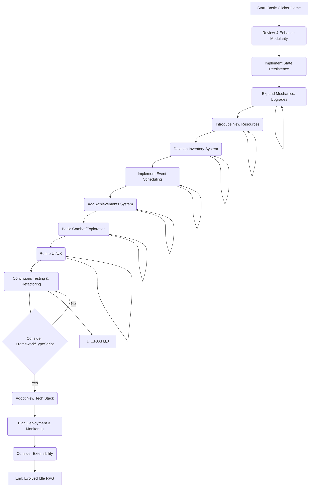

# Combined Game Development Plan: From Clicker to Idle RPG

**Goal:** Evolve the basic clicker game into a more comprehensive browser-based Idle RPG with modular code for easy expansion and maintenance.

**Current State:** A basic clicker game with score, click button, a score multiplier upgrade, and passive income is implemented using HTML, CSS, and modular JavaScript (`index.html`, `style.css`, `script.js`). The initial plan (`game_plan.md`) and a checklist (`game_plan_checklist.md`) exist, along with a high-level Idle RPG plan (`Idle RPG Plan.md`).

**Files to be created/modified:** We will continue to modify the existing files (`index.html`, `style.css`, `script.js`) and introduce new files and directories as needed to support modularity and new features (e.g., dedicated files for different game systems or UI components).

**Steps for Expansion:**

1. **Review and Enhance Code Modularity:**
    * Review the current `script.js` structure to ensure it aligns with the modular principles outlined in `Idle RPG Plan.md` (Step 2).
    * Refactor existing code into smaller, more focused modules or objects if necessary to improve separation of concerns.

2. **Implement State Persistence:**
    * Add functionality to save the current game state (score, multiplier, etc.) to the browser's `localStorage` or similar storage.
    * Implement logic to load the saved game state when the page is loaded. (Based on `Idle RPG Plan.md` Step 3.2)

3. **Expand Core Mechanics - Upgrades:**
    * Design and add new types of upgrades (e.g., upgrades that increase passive income rate, reduce upgrade costs, unlock new features).
    * Update the UI (`index.html`) to include buttons and displays for new upgrades.
    * Implement the logic for purchasing and applying these new upgrades in `script.js`, maintaining modularity. (Based on `game_plan.md` Step 7 and `Idle RPG Plan.md` Step 4)

4. **Introduce New Resources/Currencies:**
    * Define additional resources or currencies beyond the main "score" (e.g., gems, materials, energy).
    * Update the game state and display to track these new resources.
    * Integrate new resources into existing or new mechanics (e.g., some upgrades might cost a different resource).

5. **Develop Basic Inventory System:**
    * Create a system to manage items the player collects.
    * Add a simple UI section to display the inventory.
    * Implement logic for adding, removing, and potentially using items.

6. **Implement Event Scheduling System:**
    * Develop a more robust system for handling timed events or actions, which can be expanded for future features like timed buffs, missions, or production cycles. (Based on `Idle RPG Plan.md` Step 3.3)

7. **Add Achievements System:**
    * Define a set of achievements based on player progress (e.g., reaching a certain score, buying a specific number of upgrades).
    * Implement logic to track player actions and unlock achievements.
    * Add a UI section to display unlocked achievements.

8. **Basic Combat/Exploration Mechanic (Simplified Idle):**
    * Introduce a simplified system where the player can send units on missions or engage in combat that resolves over time (idle combat).
    * Define unit types, stats, and mission parameters.
    * Implement the background simulation and display results to the player.

9. **Refine UI and User Experience:**
    * Improve the visual design using CSS.
    * Ensure the UI clearly displays all relevant information (score, resources, upgrades, passive income, etc.).
    * Add visual feedback for actions (e.g., score increasing on click).

10. **Continuous Testing and Refactoring:**
    * Regularly test new features as they are implemented.
    * Dedicate time to refactor code, improve readability, and ensure the modular structure is maintained as the project grows. (Based on `Idle RPG Plan.md` Step 5)

11. **Future Considerations (from Idle RPG Plan.md):**
    * Evaluate the need for a frontend framework (React/Vue) and TypeScript as the project complexity increases.
    * Plan for deployment and monitoring.
    * Consider implementing a plugin or module registry for greater extensibility.

**Mermaid Diagram:**

This combined plan integrates the specific steps for building out the clicker game with the broader architectural and development principles from the Idle RPG plan. It provides a roadmap for evolving the current project.
